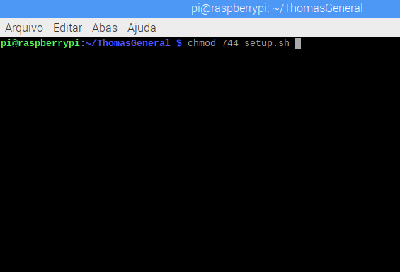
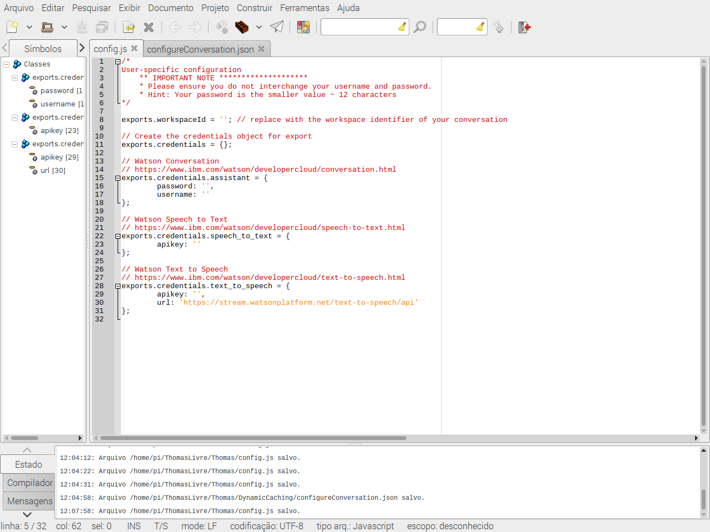
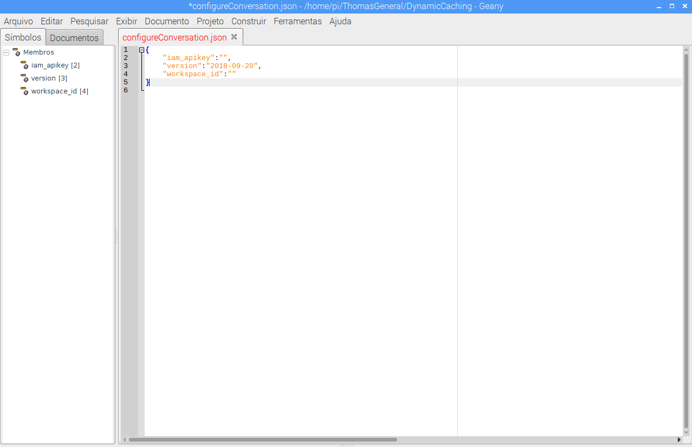
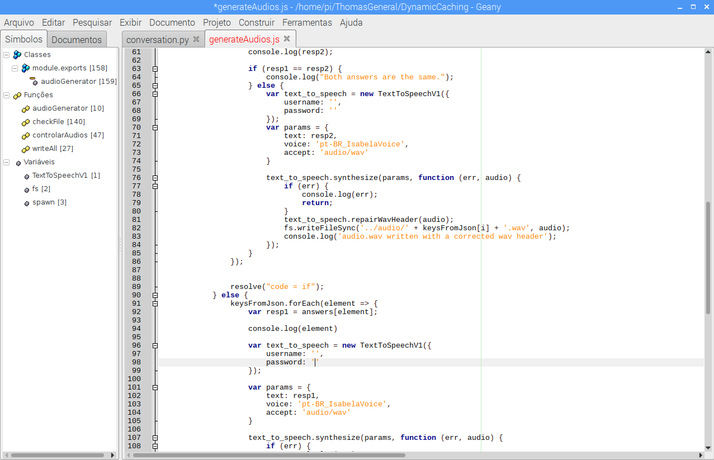

# Thomas: TJBot based assistant

Interact with tjbot in your own language, a voice based assistant fully customizable with a second screen.
TJbot is an open source IBM's project. See <a href="https://github.com/ibmtjbot/tjbot">this</a> link for more information.

## Hardware
To use this recipe you need 3 things:
- 1 Raspberry Pi 3 model B;
- 1 Speaker (P2 or USB entrance, it doesn't matter);
- 1 USB Microphone;
- 1 powerbank or any other kind of power supply;

**link to the video >>**  https://youtu.be/jxWP9CqcVe0

## This demo will need to be installed on your server and on your raspberry.

# Part 0: Requirements

* Python3
* Python
* Node

To run this demo you need to have instances of the following services deployed on your Bluemix Account:

* <a href="https://cloud.ibm.com/docs/services/assistant?topic=assistant-getting-started#getting-started-tutorial">Watson Assistant</a>
* <a href="https://console.bluemix.net/docs/services/speech-to-text/getting-started.html#gettingStarted">Watson Speech to Text</a>
* <a href="https://console.bluemix.net/docs/services/text-to-speech/getting-started.html#gettingStarted">Watson Text to Speech</a>
* <a href="https://console.bluemix.net/docs/services/discovery/getting-started-tool.html">Watson Discovery (optional)</a>

---

# Part 1: Server
Clone the repository on your pc. Anywhere you like.

```
> git clone git@git.ng.bluemix.net:Leonardo.Henrique.Machado/thomas.git
```

If you don't have git on your pc, <a href="https://www.linode.com/docs/development/version-control/how-to-install-git-on-linux-mac-and-windows/">install it</a>

 The folder `servidor100/` contains your server. Here you will recieve posts from your bot, and it will serve the screen that will be updated when it responds.


Go into `servidor100/` and install the requirements:
<br><small> Obs: Make sure pip is referring to your python3 installation</small>
```
> cd servidor100/
> pip3 install -r requirements.txt
```
Maybe, on windows, the command will be only 
````> pip install -r requirements.txt````

To run the server, you should run the following command inside your servidor100/ directory:
```
python3 welcome.py
```

After that you can access your homepage by opening the url ```http://localhost:3000```, or using the local IP Address ```http://<ip-address>:3000``` so other computers can access it.

## Displayed websites on second screen
You also need to update the intentions to point to the correct urls.

On line 10 of your ````servidor100/welcome.py```` file, you have a JSON object with a combination of keys and values, the key being an intent (defined by you on your own watson assistant service) and the value is a web site url.

Ex:
```
sites = {
    'wikipedia':'https://www.wikipedia.org/',
    'weather':'https://weather.com/'
}
```

You can use how many web sites you want in here.

## Optional
If you want to enable <b>Watson Discovery</b> on this demo, you should edit `line 60` of `welcome.py` and insert your credentials, environment ID and colletion ID.

---

# Part 2: Raspberry

On the terminal, run:
```
> cd Thomas
> sudo chmod 744 setup.sh
> sudo ./setup.sh
```


```
Edit the following files with the credentials of the services you created before (Assistant, STT, TTS):
> Thomas/config.py

```
 
 
```
> Thomas/DynamicCaching/configureConversation.json

```


```
> Thomas/DynamicCaching/generateAudios.js
> Edit the lines "67, 68, 97 and 98"
```


## Obs: If you need to generate new audios, you will need to delete a file called "sys_control" (cd /Thomas/DynamicCaching)

Then do this:

```
> cd Thomas/DynamicCaching
> python3 writeAll.py (run the file twice)
> node generateAudios.js
> cd Thomas
> python SnowBoyTest.py
```

Obs: You should add the `~/Thomas/inicial.sh` to your crontab (````@reboot ~/Thomas/inicial.sh````) if you want it to start everytime with the operating system.

Now you have Thomas running, have fun!
