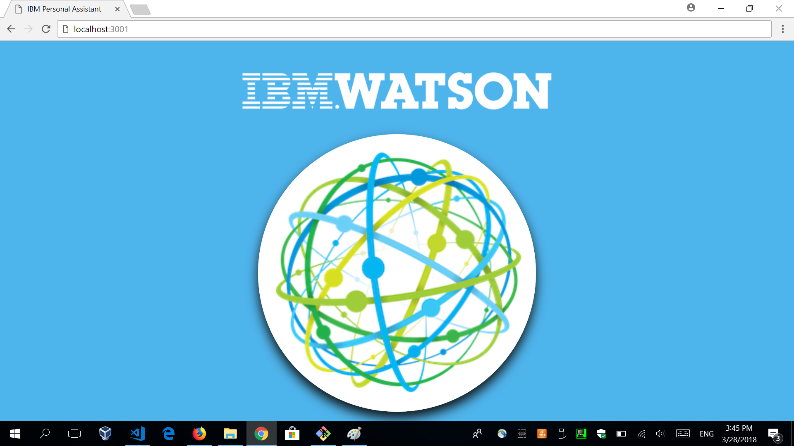
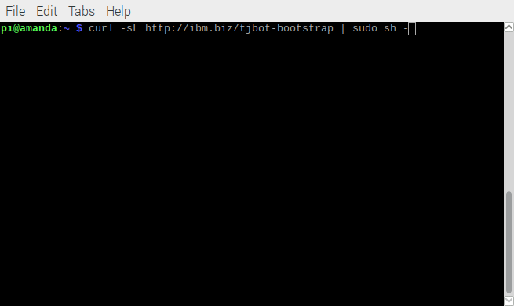
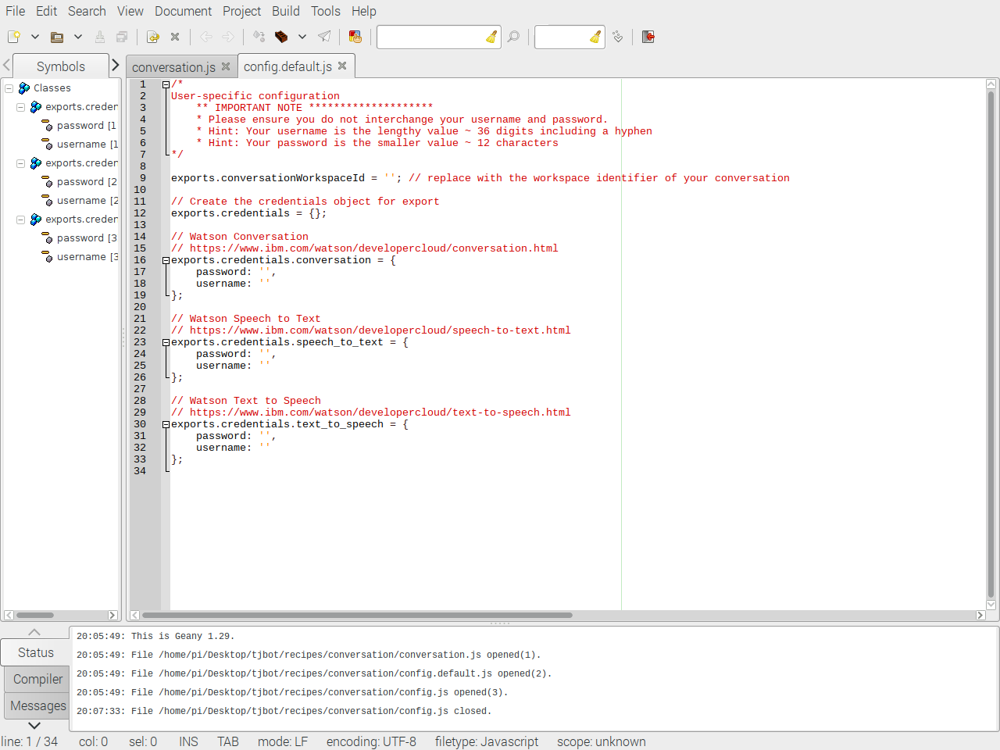

# Thomas: TJBot based assistant

Interact with tjbot in your own language, a voice based assistant fully customizable with a second screen.
TJbot is an open source IBM's project. See <a href="https://github.com/ibmtjbot/tjbot">this</a> link for more information.

## Hardware
To use this recipe you need 3 things:
- 1 Raspberry Pi 3 model B;
- 1 Speaker (P2 or USB entrance, it doesn't matter);
- 1 USB Microphone;
- 1 powerbank or any other kind of power supply;

**link to the video >>**  https://youtu.be/jxWP9CqcVe0

## This demo will need to be installed on your server and on your raspberry.

---

# Part 0: Requirements

To run this demo you need to have instances of the following services deployed on your Bluemix Account:

* <a href="https://console.bluemix.net/docs/services/conversation/getting-started.html#gettingstarted">Watson Assistant</a>
* <a href="https://console.bluemix.net/docs/services/speech-to-text/getting-started.html#gettingStarted">Watson Speech to Text</a>
* <a href="https://console.bluemix.net/docs/services/text-to-speech/getting-started.html#gettingStarted">Watson Text to Speech</a>
* <a href="https://console.bluemix.net/docs/services/discovery/getting-started-tool.html">Watson Discovery (optional)</a>

---

# Part 1: Server
Clone the repository on your pc. Anywhere you like.

```
> git clone https://github.com/GuiJordao21/Thomas.git
```

If you don't have git on your pc, <a href="https://www.linode.com/docs/development/version-control/how-to-install-git-on-linux-mac-and-windows/">install it</a>

 The folder `servidor100/` contains your server. Here you will recieve posts from your bot, and it will serve the screen that will be updated when it responds.



Go into `servidor100/` and install the requirements:
<br><small> Obs: Make sure pip is referring to your python3 installation</small>
```
> cd servidor100/
> pip3 install -r requirements.txt
```
Maybe, on windows, the command will be only 
````> pip install -r requirements.txt````

To run the server, you should run the following command inside your servidor100/ directory:
```
python3 welcome.py
```

After that you can access your homepage by opening the url ```http://localhost:3000```, or using the local IP Address ```http://<ip-address>:3000``` so other computers can access it.

## Displayed websites on second screen
You also need to update the intentions to point to the correct urls.

On line 10 of your ````servidor100/welcome.py```` file, you have a JSON object with a combination of keys and values, the key being an intent (defined by you on your own watson assistant service) and the value is a web site url.

Ex:
```
sites = {
    'wikipedia':'https://www.wikipedia.org/',
    'weather':'https://weather.com/'
}
```

You can use how many web sites you want in here.

## Optional
If you want to enable <b>Watson Discovery</b> on this demo, you should edit `line 60` of `welcome.py` and insert your credentials, environment ID and colletion ID.

---

# Part 2: Raspberry

## Dependencies

First of all, you should update your operating system: 

On the terminal, run:
```
> sudo apt-get update
> sudo apt-get upgrade
> sudo apt-get install libffi-dev python3 gcc musl-dev libssl-dev
> pip3 install watson-developer-cloud
```
## Configuring the Software
On the terminal, run:
```
curl -sL http://ibm.biz/tjbot-bootstrap | sudo sh -
```


When you run this command, you will need to answer some questions, do that:

* "Would you like to use this Raspberry Pi for TJBot? [Y/n]" 
    choose Yes.
* "Please enter a name for your TJBot. This will be used for the hostname of your Raspberry Pi." 
    Just choose your robot's name.
* "Disable ipv6? [y/N] " 
    Choose Yes.
* "Enable Google DNS? [y/N]: " 
    Choose Yes.
* "Force locale to US English (en-US)? [y/N] " 
    Choose No.
* "Proceed with apt-get dist-upgrade? [Y/n] " 
    If you choose yes here, your OS will upgrade the system and then remove some packages. This is a little bit dangerous and we recommend you DO NOT do this, so choose No.
* "Would you like to install a newer version of Node.js? [Y/n] "
    Before answer this question, open another terminal window and use the command ````node -v```` to check your versio of nodeJS. With you have version 7 or higher, you can choose No, but, if is an inferior version, you need to choose Yes.
* "Enable camera? [y/N] "
    This project do not uses Raspi camera, so choose No on this answer.
* read -p "Where should we clone it to? (default: ~/Desktop/tjbot):"
    You will have to clone this repo, but don't worry about that, you can just delete it after this.
* "Disable sound kernel modules? [Y/n] "
    DO NOT disable kernel modules.

When done, remove the cloned directory, cd to `~/` and run the following commands on the raspberry terminal:

````
> cd ~
> git clone https://github.com/GuiJordao21/Thomas.git
````
Edit the following files with the credentials of the services you created before (Assistant, STT, TTS):
````
~/Thomas/Thomas/config.js
~/Thomas/Thomas/DynamicCaching/configureConversation.json
````


Change the `line 59` of this file with the server ip address:

````
~/Thomas/Thomas/conversation.js
````

Next, go to the `Thomas/Thomas/` folder and install the dependencies. (Pay attention when running this command, because some modules maybe missing, so you will need to read the messages on your screen and install the modules using ```npm install <module name>```)
    ```
    $ cd Thomas/Thomas/
    $ npm install
    ```

Then do this:
```
> cd ~/Thomas/Thomas/DynamicCaching
> npm install
> python3 writeAll.py
> cd ~/Thomas
> chmod 744 inicial.sh
> sudo ./inicial.sh
```

Obs: You should add the `~/Thomas/inicial.sh` to your crontab (````@reboot ~/Thomas/inicial.sh````) if you want it to start everytime with the operating system.

Now you have Thomas running, have fun!