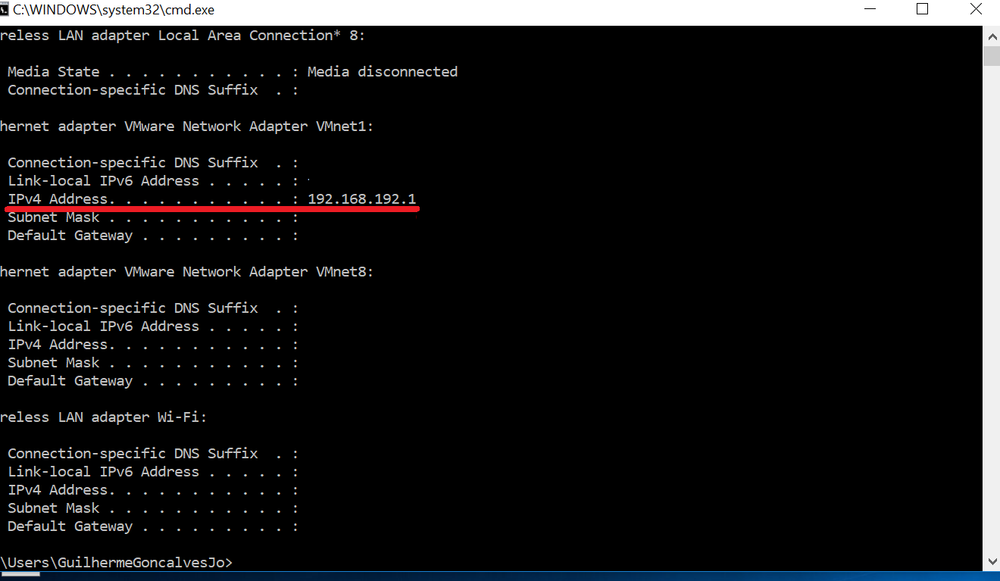

# tjbot-thomas

(to follow this tutorial, you need to have raspbian installed on your raspi sd card.)

**link to the video >>**  https://youtu.be/jxWP9CqcVe0

Interact with tjbot in your own language, a voice based assistant fully customizable with a second screen.

You have two main directories on your Thomas Project.

## You will run this ON YOUR PC, NOT ON RASPBERRY PI3.

Clone the repository on your pc. The folder `servidor100/` contains your server. Here you will recieve posts from your bot, and the screen will be updated.


First you need to cd into `servidor100/`, install the `requirements.txt` and have python3 installed. The first command you will use on cmd/terminal is:
```
pip install -r requirements.txt
```
if you are on linux:
```
pip3 install -r requirements.txt
```
To use this server full capabilities, you need to use Watson Discovery services and update line 100 of `welcome.py` and insert your credentials:
- <env> environment id;
- <col> collection id;
- <user>username;
- <pass>password.

You also need to update the intentions to point to the correct urls . We're implementing a function to do this automatically.

The most important file here is your server itself, called 'welcome.py'. To use your server, you need to cd into the directory and use:
```
python welcome.py
```
or, if you're on linux:
```
python3 welcome.py
```

After running the command above, you will open the cmd/terminal and use ipconfig (windows) / ifconfig (linux) to get the ip addres of the
server. Just keep this for you right now, we're going to use it later.



After you set everything here, we're finally going to Raspberry. I recommend a Raspberry Pi3 model B with raspbian Jessie or Stretch because
I've tested only on these versions.

## From now on, use your raspi!

Open your Raspberry terminal (**ctrl+alt+t** or click on the icon).

The first thing you're going to do is using these commands:
```
sudo apt-get update
sudo apt-get upgrade
```
This might take a while, so be patience, especially if this is the first time you are doing this.

After everything is done, you will install these programs:

```
sudo apt-get install libffi-dev python3 gcc musl-dev libssl-dev
pip3 install watson-developer-cloud
```

The simplest way to configure your Raspberry pi3 is to use this command:

```
curl -sL http://ibm.biz/tjbot-bootstrap | sudo sh -
```


If you don't have curl installed run: 
```
sudo apt-get install curl
```

after, you will start a .sh script to setup your raspi.
You will do the required setup to use just you mic and the audio output, without LED and without the camera. You need to set the name of 
your bot here (my bot's name for example is Amanda). Do not clone tjbot repo to your Raspberry.

After doing this, clone tjbot-thomas repo on `/home/pi/`.
(Maybe your path will be diferent, like `/home/name-of-your-pi`)

You will need to input your credentials on */home/pi/Desktop/Thomas/Thomas/config.js* and
*config.default.js*, insert your Speech to Text (STT) and Text to Speech (TTS) username and password also your Conversation username,
password and **WORKSPACE ID**.

On */home/pi/Thomas/Thomas/generateAudio.js* and on */home/pi/Thomas/Thomas/geraAudio.js* you will also need to
input your Text To Speech (TTS) credentials. 


One of the most important things now is to open */home/pi/Thomas/Thomas/conversation.js*  and change the **var url** on line 59
and insert over there your ip address and the port that the server is running. (For example: "http://192.168.192.1:3001/")

use the command:
```
npm install
```
on this same directory (maybe you will need to install some modules even after that, so pay attention on this step).

Go to */home/pi/Thomas/Thomas/DynamicCaching/configureConversation.json* and add your conversation credentials there too
and run the `writeAll.py` script with:
```
python3 writeAll.py
```
This will create some JSON files with your conversation content and will help you with the dynamic caching we use on our system.
After this is all set up, you can get started!!!

Go to */home/pi/Thomas/Thomas/*

and use:
```
chmod 744 inicial.sh
```
to make this script executable and voila, you're done!!!

To run, on this same folder, use:
```
./inicial.sh
```
 and the script will start.