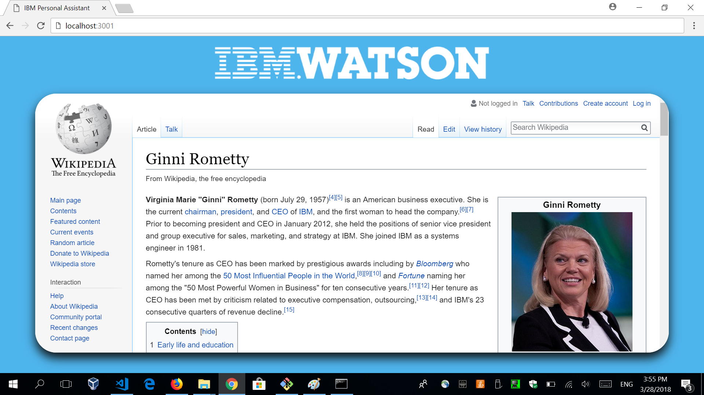

# Thomas Server

This application is built using flask. (http://flask.pocoo.org/).

## Some information about this

This server will output the website of your choice related to your conversation intents.

This is the first screen that you will see with when you start your server.

If you had an intention to talk about IBM president, for example, you can relate the intention to ginni rometty's wikipedia page for example.

There are endless possibilities for this second screen.

## Run the app locally

1. [Install Python 3][]
1. Run `pip install -r requirements.txt` to install the app's dependencies
1. Run `python welcome.py` or, if you're on linux `python3 welcome.py`
1. Access the running app in a browser at <http://localhost:3001>

[Install Python 3]: https://www.python.org/downloads/
